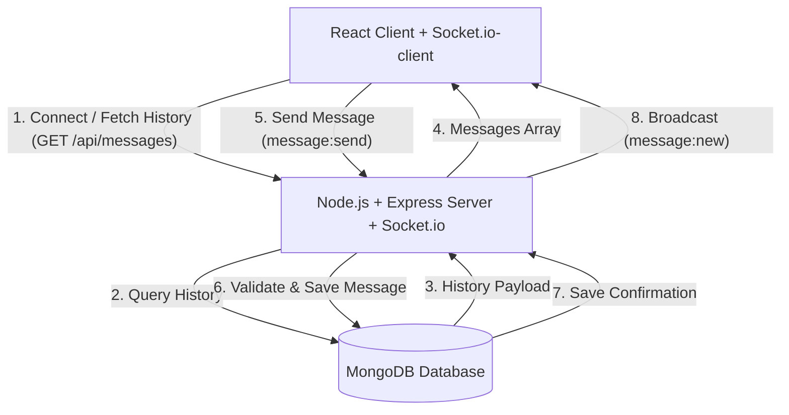

# PulseChat — Real-Time Chat Application

## Overview
PulseChat is a production-quality, high-performance real-time chat application built using **React + Vite** for the frontend client, **Node.js + Express** for the backend server, and **Socket.io** for real-time messaging, with persistent storage in **MongoDB**. 

The application utilizes a dark SaaS glassmorphic visual system with custom-built bouncing typing indicators, double-checkmark delivery/read receipts, active presence tracking, and robust connection resiliency.

---

## Features
- **Real-Time Messaging**: Bidirectional WebSocket communication via Socket.io with zero-polling latency.
- **Database Persistence**: Complete storage and retrieval of chat history in MongoDB.
- **Multi-Tab Session Isolation**: Strict tab-based isolation utilizing `sessionStorage`, allowing different active accounts in separate browser tabs without cross-pollution.
- **Active Presence Sidebar**: Real-time display of unique online users based on active socket connections.
- **Typing Indicator**: Debounced and user-filtered active typing notifications (`● ● ● Alice is typing...`).
- **Checkmark Receipt Tracking**:
  - `✓` (Sent): Message written to database.
  - `✓✓` (Delivered): Message acknowledged by the server.
  - `✓✓` (Read - blue): Message viewed by other online lounge participants.
- **Connection Resiliency**: Live status badge (🟢 Connected, 🟡 Connecting, 🔴 Disconnected) and retry banners for database/server offline exceptions.
- **Premium Styling**: Fully custom CSS styling featuring neon glowing margins, glass panels, customized webkit-scrollbars, and hardware-accelerated micro-animations.

---

## Tech Stack
- **Frontend**: React 19, Vite 8, Axios (API requests), Socket.io-client (Socket sessions), Lucide React (Vector icons)
- **Backend**: Node.js, Express, Socket.io (WebSocket adapter), Mongoose (Object-Document Modeling), Cors, Dotenv
- **Database**: MongoDB (Local community server or Atlas Cluster)

---

## Architecture



---

## Project Structure
```text
real-time-chat-app/
├── backend/                  # Node.js Express backend
│   ├── src/
│   │   ├── config/           # Database configurations (db.js)
│   │   ├── controllers/      # REST API handlers (messageController.js)
│   │   ├── models/           # Mongoose schemas (Message.js)
│   │   ├── routes/           # Routing layers (messageRoutes.js, healthRoutes.js)
│   │   ├── sockets/          # Socket.io event triggers (chatSocket.js)
│   │   ├── app.js            # Express app assembly
│   │   └── server.js         # Port listener & DNS configuration
│   ├── .env.example          # Backend configurations example
│   └── package.json          # Backend scripts & packages
│
├── frontend/                 # React Vite frontend
│   ├── src/
│   │   ├── components/       # WelcomeScreen, ChatScreen, StatusIndicator
│   │   ├── context/          # ChatContext state provider
│   │   ├── services/         # api.js and socket.js clients
│   │   ├── utils/            # dateFormatter.js helper
│   │   ├── App.jsx           # Top-level view switcher
│   │   ├── main.jsx          # DOM entry renderer
│   │   └── index.css         # CSS Variables & Glassmorphic classes
│   ├── .env.example          # Frontend configurations example
│   └── package.json          # Frontend scripts & packages
│
├── package.json              # Monorepo workspace conductor
├── .gitignore                # Git ignore files configuration
└── README.md                 # Project main documentation
```

---

## Setup & Installation

### Prerequisites
- **Node.js** (v18+)
- **npm** (v9+)
- **MongoDB** (Active instance on `localhost:27017` or Atlas connection string)

### Step 1: Install Dependencies
Run the install command from the project root directory:
```bash
npm run install-all
```
This triggers package installation for workspace scripts, backend folder, and frontend folder.

### MongoDB Setup
Make sure your local MongoDB Server service is running:
- **Windows**: `net start MongoDB` or check Services manager.
- **Mac**: `brew services start mongodb-community`
- **Linux**: `sudo systemctl start mongod`

### Backend Setup
1. Navigate to the backend directory:
   ```bash
   cd backend
   ```
2. Create your `.env` file:
   ```bash
   copy .env.example .env
   ```
3. Set your configuration variables:
   ```env
   PORT=5000
   MONGODB_URI=mongodb://localhost:27017/chat_app
   CLIENT_URL=http://localhost:5173
   ```
4. Run in development:
   ```bash
   npm run dev
   ```

### Frontend Setup
1. Open a new terminal tab and navigate to the frontend directory:
   ```bash
   cd frontend
   ```
2. Create your `.env` file:
   ```bash
   copy .env.example .env
   ```
3. Define backend paths:
   ```env
   VITE_API_URL=http://localhost:5000/api
   VITE_SOCKET_URL=http://localhost:5000
   ```
4. Start development server:
   ```bash
   npm run dev
   ```

---

## Environment Variables

### Backend (`backend/.env`)
- `PORT`: Execution port of backend (default `5000`).
- `MONGODB_URI`: Database connection URI (default `mongodb://localhost:27017/chat_app`).
- `CLIENT_URL`: Client address to configure backend CORS policy (default `http://localhost:5173`).

### Frontend (`frontend/.env`)
- `VITE_API_URL`: Backend REST API gateway path.
- `VITE_SOCKET_URL`: Backend socket instance endpoint path.

---

## REST API Documentation

### 1. Server Health
- **Endpoint**: `GET /api/health`
- **Response (200 OK)**:
  ```json
  {
    "success": true,
    "message": "Chat server is running"
  }
  ```

### 2. Message History
- **Endpoint**: `GET /api/messages`
- **Response (200 OK)**: Returns the latest 100 messages in chronological order.
  ```json
  [
    {
      "_id": "6a796e2cbad1d70785af1fcc",
      "username": "Alice",
      "message": "Hey Bob! Nice to meet you.",
      "status": "read",
      "readBy": ["Bob"],
      "timestamp": "2026-08-10T06:22:36.251Z"
    }
  ]
  ```

### 3. Send Message (REST API test/fallback)
- **Endpoint**: `POST /api/messages`
- **Headers**: `Content-Type: application/json`
- **Request Body**:
  ```json
  {
    "username": "Alice",
    "message": "Hello from API"
  }
  ```
- **Response (201 Created)**:
  ```json
  {
    "_id": "6a796e2cbad1d70785af1fcd",
    "username": "Alice",
    "message": "Hello from API",
    "status": "sent",
    "readBy": [],
    "timestamp": "2026-08-10T06:23:00.000Z"
  }
  ```

---

## Socket.io Events

| Event Name | Direction | Payload | Description |
| :--- | :--- | :--- | :--- |
| `user:join` | Client $\rightarrow$ Server | `{ username: string }` | Registers user socket connection and logs active presence. |
| `users:update` | Server $\rightarrow$ Client | `string[]` | Array of all active unique usernames currently connected. |
| `message:send` | Client $\rightarrow$ Server | `{ username: string, message: string }` | Sends chat text to the backend to be validated and saved. |
| `message:new` | Server $\rightarrow$ Client | `MessageObject` | Broadcasts newly saved database messages to all clients. |
| `typing:start` | Client $\rightarrow$ Server | None | Broadcasts that current client is typing text. |
| `typing:stop` | Client $\rightarrow$ Server | None | Broadcasts that current client stopped typing. |
| `typing:update` | Server $\rightarrow$ Client | `string[]` | List of other active usernames currently writing. |
| `message:read` | Client $\rightarrow$ Server | `{ messageId: string, username: string }` | Emits message read indicators to server. |
| `message:read` | Server $\rightarrow$ Client | `{ messageId, status, readBy }` | Updates checkmark receipts to double-blue on clients. |

---

## How Real-Time Messaging Works
1. **User Input & Submission**: A client enters text and clicks send (or hits Enter).
2. **Socket Emit (`message:send`)**: The client-side Socket connection transmits the username and message content.
3. **Validation & Database Hook**: The backend receives the socket frame, trims inputs, checks bounds (max length/empty states), and stores the record in MongoDB.
4. **Single Message Capture**: Saving happens exactly once inside the `message:send` listener. The REST API `POST` is bypassed during active socket communication to prevent double-saving.
5. **Broadcast (`message:new`)**: Mongoose yields the confirmed document (complete with generated `_id` and `timestamp`). The server broadcasts it to all connected sockets.
6. **Delivery & Read Acknowledgments**: Connected clients receive the message. Senders get a `✓` checkmark. Other clients reading it emit `message:read` back to the server, prompting checkmark color updates (`✓✓` in blue).

---

## Database Design
We use a Mongoose collection named `messages` with the following schema:
- `username`: `String` (Required, Trimmed, Max 50 chars).
- `message`: `String` (Required, Trimmed, Max 2000 chars).
- `timestamp`: `Date` (Indexed for chronological sorting, default `Date.now`).
- `status`: `String` (Enum: `['sent', 'delivered', 'read']`, default `'sent'`).
- `readBy`: `[String]` (Array of usernames who have acknowledged reading).

---

## Session Isolation
To meet constraints for multiple browser tabs:
- The username is strictly stored using **`sessionStorage`** instead of `localStorage`.
- Since `sessionStorage` isolates context per browser tab, opening two tabs allows one user to represent "Alice" and the other "Bob" simultaneously.
- Sockets are instantiated dynamically and connected after entering a username. Each tab establishes a unique socket connection with its own `socket.id`.

---

## Error Handling
- **Database Failure**: If MongoDB crashes or connection drops, backend servers survive. Messages are prevented from sending, and clients receive an `error:occurred` socket event showing an active error banner on screen with a Retry button.
- **Server Disconnection**: If the express server goes offline, Socket.io clients start automatic reconnection retries. The status badge turns red ("Disconnected"), and message input triggers are disabled to prevent state inconsistencies.
- **API Failures**: If REST history retrieval fails, fallback loaders stop and a banner displays a retry option to fetch from MongoDB again.

---

## Testing & Verification

### Manual End-to-End Checklist
1. Open `http://localhost:5173` on Tab 1. Log in as "Bob".
2. Open `http://localhost:5173` on Tab 2. Log in as "Alice".
3. Check the header presence badge: Online count displays `2` in both windows.
4. Type in Alice's composer. Bob's window displays: `● ● ● Alice is typing...`
5. Send message from Bob: `"Hello from Bob!"`. Alice receives it instantly.
6. Alice reads Bob's message. Bob's message status turns into double-blue checkmarks.
7. Close Alice's tab. Bob's presence counter instantly updates to `1` Online.
8. Refresh Bob's tab. Bob's name is retained (`sessionStorage`), and previous message history is retrieved from MongoDB.

### Production Build Verification
To build the static bundle of frontend asset files:
```bash
npm run build --prefix frontend
```
The command builds CSS bundles and index files into `frontend/dist/` without compilation warnings.

---

## Screenshots

### Welcome / Login Screen


### Global Lounge Chat


---

## Future Improvements
- **Private Messaging**: Introduce channels and rooms logic to allow private conversations between specific online users.
- **Rich Media Sharing**: Support file attachments, images, and stickers using cloud storage bucket links.
- **Persistent Authentications**: Implement JWT-based state validations with password hashes to secure active accounts.

---

## Assumptions & Design Decisions
- **No Password Auth**: Authentication is simplified to usernames for testing.
- **Automatic Read Status**: If a client has the lounge screen open, any incoming message from another user is instantly marked as `read` and triggers double checkmarks on the sender's interface.
- **Vanilla CSS Variable Theme**: Decided to utilize raw CSS custom properties to bypass tailwind version dependency problems and keep bundle sizes light.
